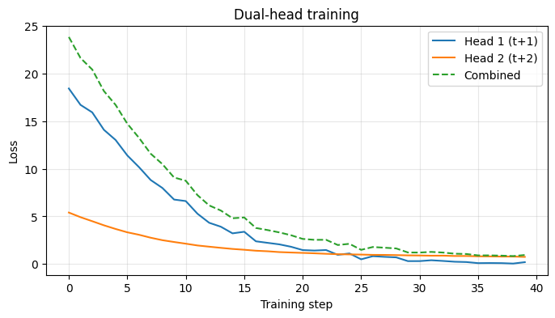

# Transformer Loss Harness — Write-Up

**Author:** Tushar Gupta  
**Colab (verified):** [Open notebook](https://colab.research.google.com/drive/1B0FOUHvzvu-mt8Wdswnegv2gL7cvMx3H?usp=sharing)  
**GitHub:** [`transformer-loss-harness/`](https://github.com/curioustushar/blog/tree/master/transformer-loss-harness)  
**Live post:** [Transformer Loss Harness](https://curioustushar.github.io/blog/posts/transformer-loss-harness/)

---

## Configuration

```
HarnessConfig(vocab_size=256, hidden_dim=128, num_layers=2, num_heads=4,
              batch_size=4, seq_len=32, train_steps=40, lr=0.0003)
seed = 42
```

---

## Part 1 — Seven required numbers

### 1. Tensor / shape configuration

| Tensor | Shape |
|--------|-------|
| `tokens` | `[4, 32]` |
| `hidden` | `[4, 32, 128]` |
| `logits` | `[4, 32, 256]` |
| `shifted_logits` | `[124, 256]` |
| `shifted_targets` | `[124]` |

### 2. Valid token count after padding masking

- **Contributing positions:** **20** of **124**  
- **Loss without mask:** **5.557**  
- **Loss with mask:** **5.658**  

### 2b. Wrong denominator

- **Loss with wrong denominator (`B×T`):** **5.557**  

Matches unmasked mean — confirms padding positions were included in the divisor.

### 3–4. Packed-document boundary masking

- **Loss before boundary mask:** **5.707**  
- **Loss after boundary mask:** **5.749**  

Packed with `<eos>` between documents. Mask removes `<eos>` → `The` cross-doc prediction.

### 5. Initial perplexity

| Metric | Value |
|--------|-------|
| Vocabulary size | 256 |
| Initial perplexity | **286.5** |
| Ratio ppl / vocab | 1.12 ✓ |

### 6. Tied vs untied parameter counts

| Configuration | Parameters |
|---------------|------------|
| Tied | **429,312** |
| Untied | **462,080** |
| Difference | **32,768** |

### 7. Ordinary vs chunked cross-entropy peak memory

| Metric | Value |
|--------|-------|
| Ordinary CE peak | **624 B** |
| Chunked CE peak | **1200 B** |
| Ratio (ordinary / chunked) | **0.52** |

CPU/tracemalloc fallback in this run. Re-run §1.7 with GPU runtime for GiB-scale VRAM.

---

## Part 2 — Dual-head losses (40 training steps)

| Loss | Value |
|------|-------|
| Next-token (t+1) | **0.196** |
| Two-token-ahead (t+2) | **0.752** |
| Combined (sum) | **0.948** |



---

## Part 3 — Wrong-shift demonstration

```
Input tokens : ['cat', 'sat', 'on', 'the', 'mat', '.']
Target tokens: ['The', 'cat', 'sat', 'on', 'the', 'mat']
```

| Loss | Value |
|------|-------|
| Wrong-shift | **5.630** |
| Correct-shift | **5.658** |

Shapes match. Scalar losses are nearly identical — strings reveal the bug; IDs do not.

---

## Main implementation lesson

Never trust the scalar loss until you have verified decoded token strings, contributing token counts, correct denominators, and perplexity sanity.

---

## Reproduce

```bash
cd transformer-loss-harness
python build_notebook.py
```

Upload `transformer_loss_harness.ipynb` to Colab and run top to bottom.
