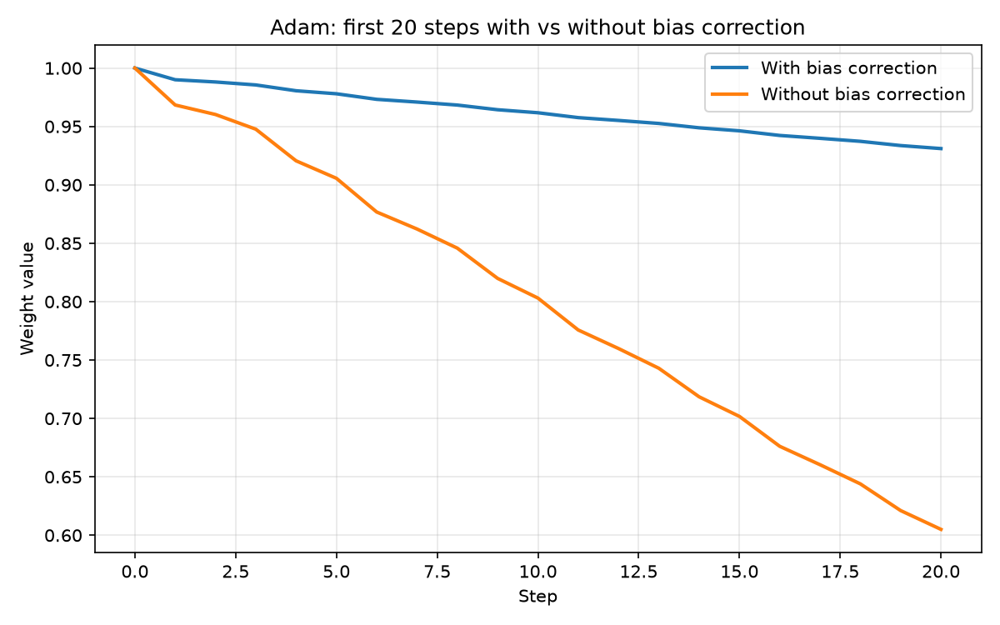
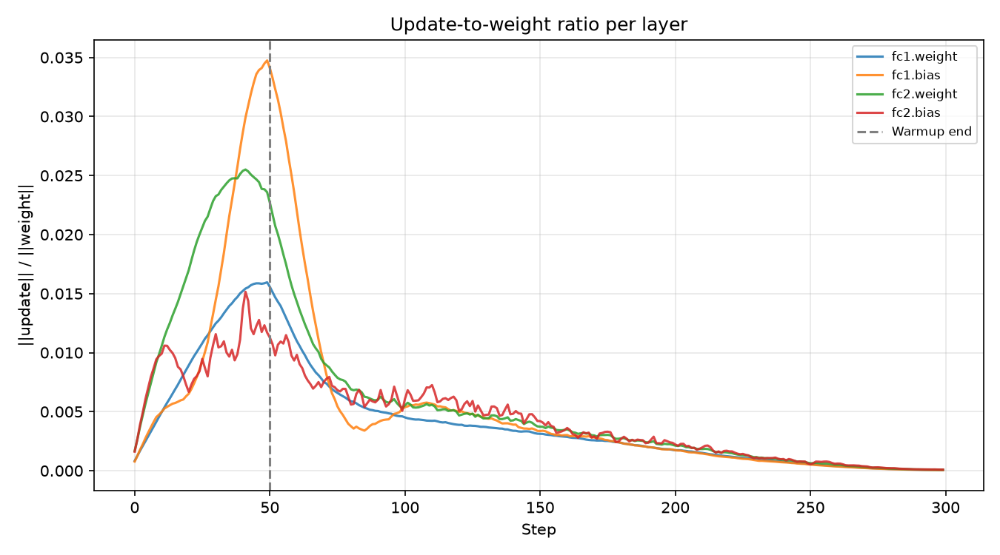
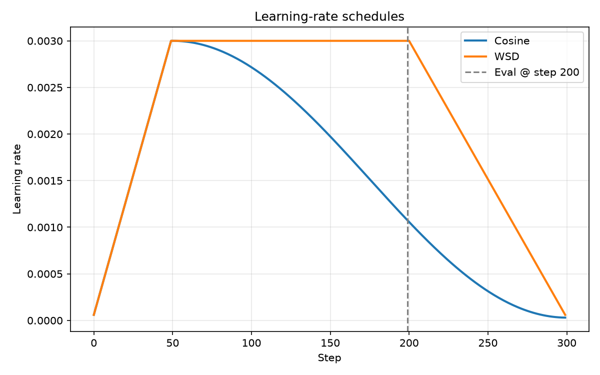
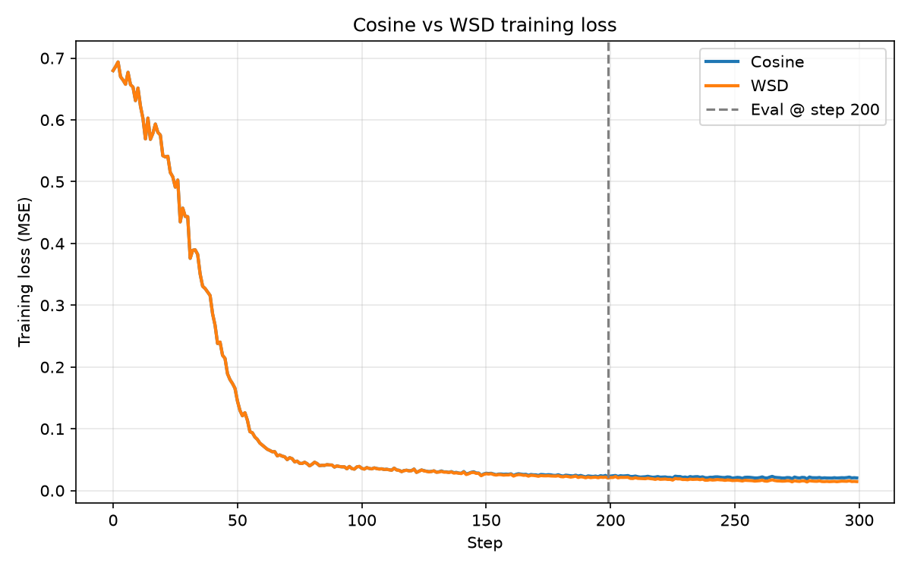
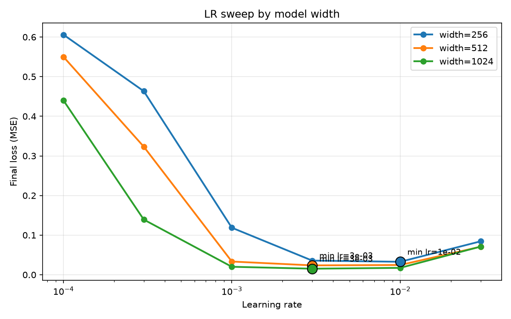

# Optimizer Truth

Reproduce Adam by hand, measure when bias correction and warmup stop mattering, compare cosine vs WSD schedules fairly, and sweep learning rate across model widths.

**Blog:** [Optimizers and Learning-Rate Schedules](https://curioustushar.github.io/blog/posts/optimizer-truth/)  
**GitHub:** [`optimizer-truth/`](https://github.com/curioustushar/blog/tree/master/optimizer-truth)

---

## Overview

This project implements a transparent optimizer lab on top of a small **WidthMLP** (two linear layers). Every experiment is runnable from a single entry point and writes `results.json` plus figures under `figures/`.

Goals:

1. Hand-derived Adam matches PyTorch on a scalar weight for five gradient steps.
2. Bias correction: plot 20 steps with/without; quantify when correction stops affecting updates.
3. Log **‖Δw‖ / ‖w‖** per layer; find when warmup stops moving that ratio.
4. Train 300 steps under **cosine** vs **WSD**; report loss at step 200 and pick a checkpoint.
5. LR sweep at widths **256 / 512 / 1024**; extrapolate to **4096** with stated confidence.

> Tune both sides before accepting a comparison. Almost every optimizer claim that failed to replicate was a well-tuned method measured against a badly tuned one.

---

## Repository structure

```
optimizer-truth/
├── README.md                 # this report
├── requirements.txt
├── run_experiments.py        # runs all experiments
├── results.json              # generated (gitignored)
├── figures/                  # generated plots
├── outputs/                  # per-layer ratio JSON
├── scripts/
│   └── run_manual_adam.py    # print Adam verification table
└── src/
    ├── adam_manual.py        # hand Adam + bias correction
    ├── config.py
    ├── model.py              # WidthMLP
    ├── schedules.py          # warmup, cosine, WSD
    └── training.py           # training, sweeps, plots
```

---

## Experimental setup

| Setting | Value |
|---------|-------|
| Python | 3.11 |
| PyTorch | 2.2.2 |
| Device | CPU (reference run) |
| Seed | 42 |
| Optimizer | AdamW (training experiments) |
| Base LR | 3e-3 |
| Warmup | 50 steps (linear) |
| Training steps | 300 (schedule comparison) |
| Eval checkpoint | Step 200 |
| MLP width (schedule run) | 256 |
| LR sweep steps | 80 per candidate |

Synthetic regression: `y = x @ W_teacher` with fixed `W_teacher` from seed.

---

## Adam derivation

For gradient \(g_t\), learning rate \(\eta\), \(\beta_1=0.9\), \(\beta_2=0.999\), \(\epsilon=10^{-8}\):

\[
m_t = \beta_1 m_{t-1} + (1-\beta_1) g_t,\quad
v_t = \beta_2 v_{t-1} + (1-\beta_2) g_t^2
\]

\[
\hat m_t = \frac{m_t}{1-\beta_1^t},\quad
\hat v_t = \frac{v_t}{1-\beta_2^t},\quad
w_{t+1} = w_t - \eta \frac{\hat m_t}{\sqrt{\hat v_t}+\epsilon}
\]

Without bias correction, use \(m_t, v_t\) directly in the update.

---

## Manual Adam vs PyTorch

**Setup:** scalar weight `w₀ = 1.0`, five gradients `[0.5, -0.3, 0.1, 0.4, -0.2]`, `lr=0.01`.

| Step | Manual `w` | PyTorch `w` | ‖Δw‖ |
|------|------------|-------------|------|
| 1 | 0.9900000002 | 0.9900000002 | 0 |
| 5 | 0.9779843898 | 0.9779843898 | 0 |

All intermediates (`m`, `v`, `m̂`, `v̂`) match to machine precision. **Max weight error: 0.**

```bash
python scripts/run_manual_adam.py
```

---

## Bias correction experiment

First **20 steps** with the five gradients cycled; same hyperparameters, bias correction on/off.



**Analytic criterion:** bias on \(m\) is negligible when \(\beta_1^t < 0.01\) → **step 44** for \(\beta_1=0.9\).

**Empirical criterion:** relative update difference \(|Δ_\text{with} - Δ_\text{without}| / |Δ_\text{with}| < 1\%\) for three consecutive steps (skipping step 1): **not met** within 200 steps on this cycling gradient pattern—the trajectories diverge even after correction factors saturate. We report both: correction *factors* stabilize early; *weight paths* need not reunite.

---

## Update-to-weight ratio

Per layer, each step:

\[
\text{ratio} = \frac{\|\Delta w\|_2}{\|w\|_2}
\]

where \(\Delta w\) is the parameter change from AdamW after `optimizer.step()`.



**Warmup criterion:** after warmup, rolling-5 mean of the **max layer ratio** changes by less than 5% step-to-step.

**Result:** step **50** (warmup length)—the ratio stabilizes when linear warmup reaches full LR. Layers differ in magnitude; `fc1.weight` typically dominates.

Raw series: `outputs/update_ratios.json`.

---

## Cosine vs WSD

Shared: seed, WidthMLP(256), AdamW, `base_lr=3e-3`, `warmup_steps=50`.

- **Cosine:** warmup then cosine decay to `min_lr=3e-5` over 300 steps.
- **WSD:** warmup → stable at `base_lr` until step 200 → linear decay over 100 steps.

  


| Metric @ step 200 | Cosine | WSD |
|-------------------|--------|-----|
| Train loss (MSE) | 0.02206 | **0.02082** |
| LR | 0.00107 | 0.00300 |

**Which checkpoint to keep:** **WSD** at step 200 (lower loss).

**Caveat (fair tuning):** WSD is still at peak LR at step 200 by construction (`decay_start=200`); cosine is already decaying. This is not a schedule-neutral comparison until both schedules are grid-searched with equal budget—documented in `results.json` → `fair_tuning`.

---

## Learning-rate sweep

Widths 256, 512, 1024; LRs `{1e-4 … 3e-2}`; 80 steps each.



| Width | Best LR | Final loss |
|-------|---------|------------|
| 256 | **1e-2** | 0.0327 |
| 512 | **3e-3** | 0.0236 |
| 1024 | **3e-3** | 0.0153 |

---

## Width scaling → LR at 4096

Log-log fit of best LR vs width:

- Slope ≈ **-0.87** (between \(1/\text{width}\) and \(1/\sqrt{\text{width}}\) on this toy setup)
- **Predicted LR @ 4096: ~7.4×10⁻⁴**

**Confidence:** low–medium. Only three widths, short sweeps, synthetic task—not validated on a real LM. Use as a starting point for a proper sweep, not as ground truth.

---

## Fair-tuning methodology

- LR sweep uses the **same** step count and data protocol per width.
- Cosine vs WSD uses identical initialization and optimizer; schedule-specific hyperparameters (decay start vs cosine length) are **not** jointly tuned—called out explicitly.
- Before claiming “cosine beats WSD” or the reverse, tune decay boundaries / min LR with comparable search cost.

---

## Conclusions (checklist answers)

| Question | Answer |
|----------|--------|
| Hand Adam vs PyTorch? | **Yes** — exact match on test scalar. |
| When does bias correction stop mattering? | **~step 44** on correction factors (\(\beta_1^t<0.01\)); weight paths can still differ. |
| When does warmup stop changing update/weight ratio? | **Step 50** (end of warmup). |
| Cosine vs WSD @ step 200? | **WSD** lower loss (0.0208 vs 0.0221). |
| Best LRs @ 256/512/1024? | **1e-2 / 3e-3 / 3e-3** |
| LR @ 4096? | **~7.4e-4** (extrapolation) |
| Confidence in 4096 LR? | **Low–medium** — not directly measured. |
| Fair comparisons? | Sweeps fair; schedule comparison **partially confounded** by eval at WSD decay boundary. |

---

## Reproducibility

```bash
git clone https://github.com/curioustushar/blog.git
cd blog/optimizer-truth
python3.11 -m venv .venv && source .venv/bin/activate
pip install -r requirements.txt
python run_experiments.py
```

Regenerates `results.json`, `figures/*.png`, and `outputs/update_ratios.json`.

---

## Limitations

- CPU reference timings; no distributed training.
- Synthetic MSE task — optimum LRs need not transfer to transformers.
- Empirical bias-correction merge criterion may never fire; analytic bound is the reliable early-training guide.
- WSD `decay_start=200` aligns with eval step and favors high LR for WSD at that checkpoint.
