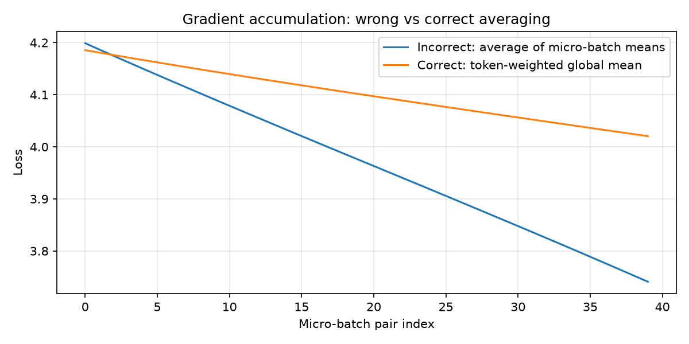

# Training Loop Truth

Take a small model and a real loop, and make it tell you the truth about itself.

Inspect tensor shapes, verify gradients by hand, break gradient accumulation on purpose, log grad norms, compute MFU honestly, and derive floating-point bit patterns for `0.1`.

**Live write-up:** [blog post](https://curioustushar.github.io/blog/posts/training-loop-truth/)  
**GitHub:** [training-loop-truth/](https://github.com/curioustushar/blog/tree/master/training-loop-truth)

## Repository structure

```
training-loop-truth/
├── README.md
├── notebook.ipynb          # primary deliverable — run top to bottom
├── requirements.txt
├── run_experiments.py      # regenerates results.json + figures/
├── build_notebook.py       # regenerates notebook.ipynb
├── src/
│   ├── config.py
│   ├── model.py            # TinyCharLM
│   ├── training.py         # loop, grad check, accumulation plots
│   ├── mfu.py
│   └── float_repr.py       # FP32 / BF16 / FP8 E4M3 for 0.1
└── figures/
    ├── gradient_accumulation.png
    ├── loss_vs_step.png
    └── grad_norm_vs_step.png
```

## Environment

| Item | Value |
|------|-------|
| Python | 3.11+ |
| PyTorch | 2.2+ |
| Device (reference run) | CPU |
| GPU reference peak (MFU) | 15 TFLOP/s (T4-class estimate) |

## How to run

```bash
git clone https://github.com/curioustushar/blog.git
cd blog/training-loop-truth
python3.11 -m venv .venv && source .venv/bin/activate
pip install -r requirements.txt
jupyter notebook notebook.ipynb
```

Or regenerate artifacts:

```bash
python run_experiments.py   # writes results.json + figures/
python build_notebook.py  # writes notebook.ipynb
```

## Configuration

| Setting | Value |
|---------|-------|
| Model | TinyCharLM (Embedding → ReLU → Linear), **8,320 params** |
| Vocab | 64 |
| Batch × seq | 8 × 16 |
| Optimizer | Adam, lr=0.01 |
| Loss | Next-token cross-entropy |
| Training steps | 120 |

## Results (reference CPU run)

### Tensor shapes

| Tensor | Shape | Meaning |
|--------|-------|---------|
| tokens | `[8, 16]` | batch × sequence |
| logits | `[8, 16, 64]` | batch × sequence × vocab |
| loss | scalar | mean CE over positions |

### Gradient finite-difference check (`fc2.bias[0]`)

| Metric | Value |
|--------|-------|
| Numerical grad | -0.01431 |
| Autograd grad | -0.01498 |
| Relative diff | **4.5%** ✓ |

### Gradient accumulation (10 vs 100 tokens per micro-batch)

| Method | Loss |
|--------|------|
| Wrong (avg of averages) | 4.196 |
| Correct (token-weighted) | 4.210 |
| Gap | 0.015 |



### Grad norm before loss moves

At **step 91**: grad norm dropped 0.198 → 0.172 while loss moved only 4.170 → 4.169. Gradients react to input drift before loss visibly shifts.

### MFU (honest estimate)

| Metric | Value |
|--------|-------|
| **Measured MFU** | **~0.03%** (CPU run vs 15 TFLOP/s GPU peak) |
| Tokens/sec | ~91k |
| FLOPs/step | 6×N×tokens ≈ 6M |

**Why far below 40%:** tiny model (8k params), tiny batch (120 tokens/step), Python/autograd overhead, no fused kernels, CPU run. On a real GPU with a large model and batch, kernel occupancy and memory bandwidth become the levers — here we are nowhere near them.

### 0.1 in floating point

| Format | Hex | Stored | Error vs 0.1 |
|--------|-----|--------|--------------|
| FP32 | `0x3DCCCCCD` | 0.1000000015 | ~1.5e-9 |
| BF16 | `0x3DCC` | 0.099609375 | -3.9e-4 |
| FP8 E4M3 | `0x2A` | 0.1015625 | +1.6e-3 |

### Precision recommendation

**BF16** for forward/backward matmuls, **FP32** for optimizer master weights and loss accumulation. FP8 E4M3 for selective matmuls with scaling on hardware that supports it — not as a blanket replacement.

## Conclusions

1. Autograd matches finite differences when you nudge a bias that directly shifts logits.
2. Averaging micro-batch means silently overweight short sequences.
3. Grad norm can move before loss does — watch both traces.
4. MFU on a toy CPU run is near zero vs datacenter GPU peaks; the formula still teaches what to optimize at scale.
5. BF16 is the practical training default; FP8 is a throughput tool with narrower precision.

## Key lesson

> Do not trust the loop until you have verified shapes, one gradient by hand, and the denominator in your loss average.
